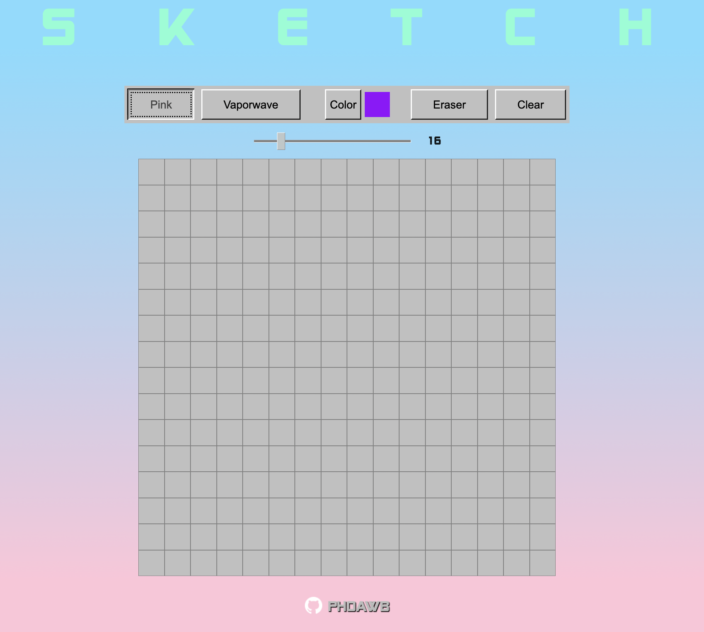

# Vaporwave themed Etch-a-Sketch in the browser

This is an Etch-a-Sketch in the browser as a part of [The Odin Project](https://www.theodinproject.com/lessons/foundations-etch-a-sketch).

### [Live Demo](https://phoawb.github.io/Etch-A-Sketch/)

## Features

This is a list of features that the Etch-a-Sketch has that i implemented as a part of the learning process.

- [x] Gradient background
- [x] Fast and realtime resizing
- [x] Dynamic resizing
- [x] Animations
- [x] Buttons being "selected" on click
- [x] Making the gradient (somewhat) consistent on safari
- [x] Making the mousover cell highlited

## Preview

